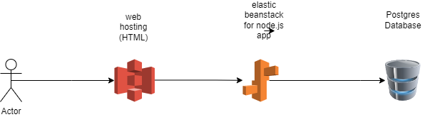

### Udagram Infrastructure

---

### AWS

#### S3 bucket Static website

Front end application deployed for s3 bucket
bucket is public readable

URL : [http://udagram-b.s3-website-us-east-1.amazonaws.com](http://udagram-b.s3-website-us-east-1.amazonaws.com)

#### Elastic Beanstalk

Application Server deployed to elastic 

URL : [http://udagram-env.eba-vvc4x2gs.us-east-1.elasticbeanstalk.com](http://udagram-env.eba-vvc4x2gs.us-east-1.elasticbeanstalk.com)

#### RDS Postgres Database

Application database that used from elastic beanstalk

URL : [database-1.cdn4dbwaet5o.us-east-1.rds.amazonaws.com
]()