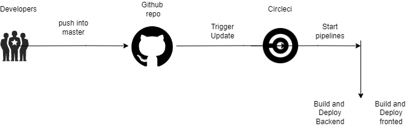

### Udagram Pipeline

---

### CI/CD

#### Github

After push into master repository, Github will trigger to circleci platform to start the pipelines

#### CircleCI

Read from .circleci/config.yml which have all orderd piplines to finish the deploy

* Frontend : Run build and deploy from the `package.json` to move the updates into s3 bucket

* Backend : Run thee build scripts and upadate elastic beanstalk with new code and take elastic configuration from `.elasticbeanstalk/config.yml`
